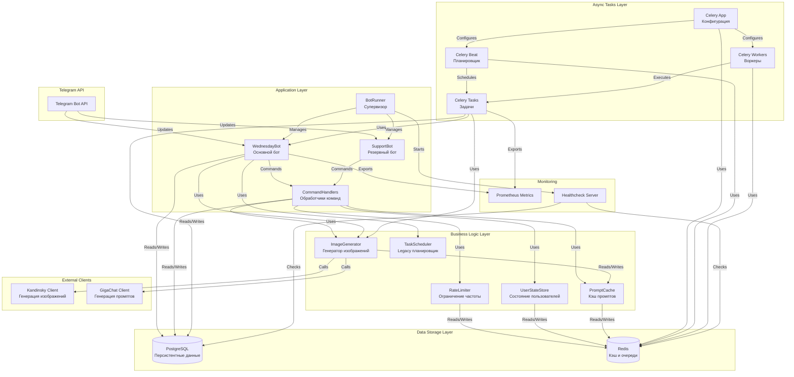
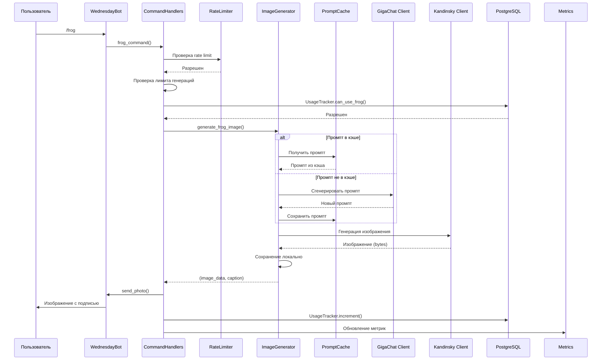
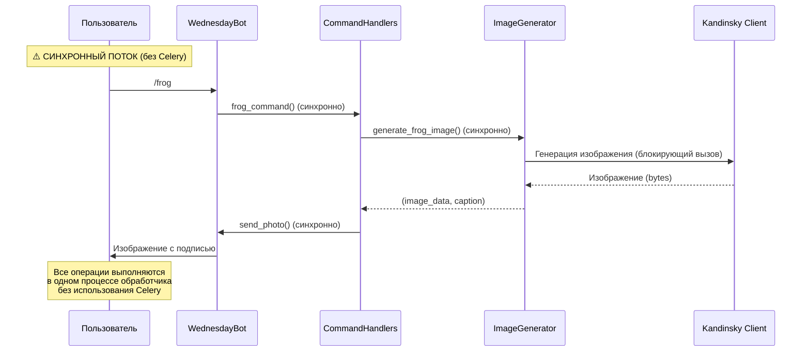
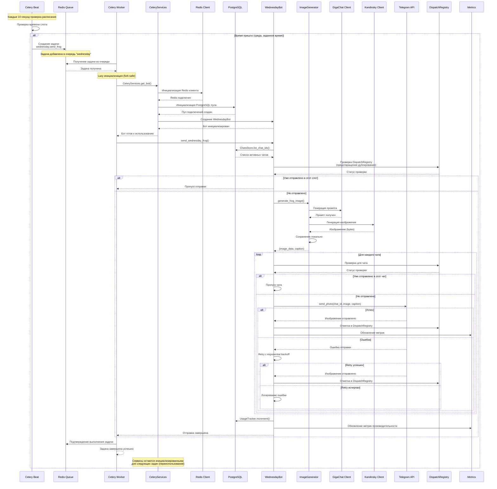

# Архитектура Wednesday Frog Bot

## Обзор

Wednesday Frog Bot — это Telegram-бот для автоматической генерации и отправки изображений жабы каждую среду. Проект использует многоуровневую архитектуру с разделением ответственности между компонентами.

### Основные слои архитектуры

1. **Интерфейсный слой** — взаимодействие с Telegram API через python-telegram-bot
2. **Бизнес-логика** — обработка команд, генерация изображений, планирование задач
3. **Хранилище данных** — PostgreSQL для персистентных данных, Redis для кэша и очередей
4. **Асинхронные задачи** — Celery для фоновых операций и планирования

## Компоненты системы

### BotRunner

**Назначение:** Супервизор, управляющий жизненным циклом ботов и переключением между основным и резервным режимами.

**Основные функции:**
- Инициализация и управление WednesdayBot и SupportBot
- Graceful shutdown при получении сигналов (SIGINT, SIGTERM)
- Переключение между основным и резервным ботом без потери соединений
- Инициализация инфраструктуры (Redis, PostgreSQL)
- Запуск вспомогательных сервисов (Prometheus exporter, healthcheck server)

**Особенности:**
- Использует паттерн Supervisor для управления двумя ботами
- Обеспечивает, что только один бот активен в любой момент времени
- Передает состояние между ботами через `pending_startup_edit` и `pending_shutdown_edit`

### WednesdayBot

**Назначение:** Основной бот с полным функционалом генерации и отправки изображений.

**Основные функции:**
- Обработка команд пользователей и администраторов
- Генерация изображений через ImageGenerator
- Автоматическая отправка по расписанию (через Celery или TaskScheduler)
- Управление чатами и пользователями
- Отслеживание использования и метрик

**Компоненты:**
- `CommandHandlers` — обработка всех команд
- `ImageGenerator` — генерация изображений
- `TaskScheduler` (опционально) — legacy планировщик
- `UsageTracker` — отслеживание лимитов
- `ChatsStore` — управление активными чатами
- `DispatchRegistry` — предотвращение дублирования отправок
- `Metrics` — сбор метрик производительности

### SupportBot

**Назначение:** Резервный бот, активируемый при остановке основного бота.

**Основные функции:**
- Отображение сообщения о техработах для пользователей
- Предоставление доступа к логам администраторам
- Команда `/start` для запуска основного бота
- Минимальный набор команд для обслуживания

**Особенности:**
- Никогда не работает одновременно с WednesdayBot
- Использует тот же Telegram токен, но с ограниченным функционалом
- Автоматически активируется при остановке основного бота

### Handlers (CommandHandlers)

**Назначение:** Обработка всех команд Telegram-бота.

**Основные команды:**
- **Пользовательские:** `/start`, `/help`, `/frog`, `/status`
- **Административные:** `/force_send`, `/add_chat`, `/remove_chat`, `/list_chats`, `/log`, `/stop`
- **Управление моделями:** `/set_kandinsky_model`, `/set_gigachat_model`, `/list_models`
- **Управление админами:** `/mod`, `/unmod`, `/list_mods`
- **Управление лимитами:** `/set_frog_limit`, `/set_frog_used`

**Особенности:**
- Rate limiting для команды `/frog` (per-user и global)
- Проверка прав администратора для админ-команд
- Retry логика для сетевых ошибок
- Дружелюбные сообщения об ошибках для пользователей

### Services

**Dependency Injection (DI):**

Проект использует **ручную инициализацию зависимостей** без специализированных DI-библиотек:

- **В BotRunner:** Сервисы создаются напрямую в конструкторах (`WednesdayBot.__init__()`, `SupportBot.__init__()`)
- **В CommandHandlers:** Зависимости передаются через конструктор (например, `ImageGenerator` передается при создании)
- **Для внешних клиентов:** Используются фабрики (`create_image_client()`, `create_text_client()`), которые возвращают контейнеры (`ImageClientContainer`, `TextClientContainer`) для поддержки замены моделей в runtime
- **Через bot_data:** Некоторые сервисы доступны через `context.application.bot_data` (например, `usage`, `chats`, `metrics`)

Такой подход обеспечивает явность зависимостей и упрощает тестирование (легко подставлять моки через конструкторы).

#### ImageGenerator

**Назначение:** Генерация изображений жабы с помощью Kandinsky API и GigaChat.

**Основные функции:**
- Генерация промптов через GigaChat (с fallback на статические)
- Генерация изображений через Kandinsky API
- Circuit breaker для защиты от перегрузки API
- Кэширование промптов и параметров генерации
- Сохранение изображений локально
- Fallback на случайные изображения из архива при ошибках

**Архитектура:**
- Использует Protocol-интерфейсы (`ITextToImageClient`, `ITextToTextClient`)
- Dependency Injection для клиентов через фабрики (`create_image_client()`, `create_text_client()`)
- Поддержка замены моделей в runtime через контейнеры (`ImageClientContainer`, `TextClientContainer`)

#### RateLimiter

**Назначение:** Ограничение частоты запросов на основе Redis.

**Алгоритм:**
- Fixed window rate limiting
- Атомарные операции через Redis INCR/EXPIRE
- Автоматический fallback в in-memory режим при недоступности Redis
- Fail-open политика (не блокирует пользователей при сбоях инфраструктуры)

#### PromptCache

**Назначение:** Кэширование промптов и параметров генерации в Redis.

**Особенности:**
- Ускоряет повторные генерации с теми же параметрами
- Снижает нагрузку на GigaChat API
- Автоматическая очистка устаревших записей

#### UserStateStore

**Назначение:** Временное хранение состояния пользователей (диалоги, флаги).

**Использование:**
- Состояния диалогов для многошаговых команд
- Временные флаги и метаданные
- Автоматическое истечение через TTL

#### TaskScheduler (Legacy)

**Назначение:** Планировщик задач на основе asyncio (используется только если `USE_OLD_SCHEDULER=true`).

**Функции:**
- Планирование отправки каждую среду в заданное время
- Поддержка часовых поясов
- Асинхронное выполнение задач

**Примечание:** В продакшене рекомендуется использовать Celery Beat вместо TaskScheduler.

### Workers (Celery)

#### Celery App

**Назначение:** Конфигурация Celery для асинхронных задач.

**Настройки:**
- Redis как брокер и backend
- Разделение задач по очередям: `wednesday`, `images`, `maintenance`
- Настройка retry для сетевых ошибок
- Dead Letter Queue для неудачных задач
- Timezone support для корректного планирования

#### Celery Beat

**Назначение:** Планировщик периодических задач.

**Задачи:**
- `wednesday.send_frog` — отправка изображений каждую среду в заданное время
- `wednesday.daily_cleanup` — ежедневная очистка старых данных
- `wednesday.daily_statistics` — сбор статистики
- `wednesday.beat_heartbeat` — healthcheck для Beat

**Расписание:**
- Настраивается через `SCHEDULER_SEND_TIMES` (по умолчанию: 09:00, 12:00, 18:00)
- День недели настраивается через `SCHEDULER_WEDNESDAY_DAY` (по умолчанию: 2 = среда)

#### Celery Tasks

**Основные задачи:**

1. **`send_wednesday_frog`** — автоматическая отправка изображений
   - Lazy инициализация сервисов (fork-safe)
   - Retry для сетевых ошибок
   - Soft/hard time limits

2. **`generate_frog_image`** — генерация изображения в фоне
   - Используется для асинхронной генерации по команде `/frog`
   - Отдельная очередь для изоляции

3. **`daily_cleanup`** — очистка старых данных
   - Очистка dispatch_registry
   - Удаление временных файлов

4. **`daily_statistics`** — сбор статистики
   - Агрегация метрик
   - Обновление дашбордов

**Особенности:**
- **Lazy инициализация через `CeleryServices` (fork-safe):** Критически важно для корректной работы Celery в Python. Сервисы (Redis, PostgreSQL, WednesdayBot) инициализируются **только после fork** worker процесса, внутри задач. Это предотвращает:
  - Утечки ресурсов (разделяемые соединения между процессами)
  - Ошибки "connection already closed" при fork
  - Race conditions при одновременном доступе к соединениям
  - Проблемы с async клиентами (aiohttp, asyncpg), которые не являются fork-safe
- Graceful shutdown при остановке worker
- Метрики Prometheus для мониторинга

## Схемы взаимодействия

### Диаграмма 1: Общая схема компонентов (Component Diagram)

### Диаграмма 2: Поток данных при генерации изображения (Sequence Diagram)

### Диаграмма 2a: Синхронный поток команды `/frog` (без Celery)

### Диаграмма 3: Поток данных автоматической отправки (Flowchart)

### Диаграмма 3a: Детальный поток автоматической отправки через Celery (Sequence Diagram)

Эта диаграмма показывает детальное взаимодействие компонентов при автоматической отправке через Celery, включая:
- Lazy инициализацию сервисов (fork-safe подход)
- Взаимодействие с Redis и PostgreSQL
- Обработку ошибок и retry логику
- Обновление метрик и реестра отправок

## Потоки данных

### 1. Ручная генерация (`/frog`)

1. Пользователь отправляет команду `/frog`
2. `CommandHandlers.frog_command()` проверяет rate limit
3. Проверяется лимит генераций через `UsageTracker`
4. `ImageGenerator.generate_frog_image()` генерирует изображение:
   - Получает или генерирует промпт (GigaChat или fallback)
   - Генерирует изображение через Kandinsky API
   - Сохраняет локально
5. Изображение отправляется пользователю
6. Обновляются счетчики использования и метрики

**Примечание:** Команда `/frog` выполняется синхронно в обработчике бота и не использует Celery для фоновой обработки. Это обеспечивает быстрый ответ пользователю, но генерация происходит в том же процессе, что и обработка команды. Автоматические отправки по расписанию используют Celery.

### 2. Автоматическая отправка (Celery Beat)

1. Celery Beat проверяет расписание каждые 10 секунд
2. При наступлении времени слота (среда, заданное время) создается задача
3. Задача добавляется в очередь Redis (`wednesday`)
4. Celery Worker берет задачу из очереди
5. Инициализируются сервисы (lazy init, fork-safe)
6. `WednesdayBot.send_wednesday_frog()` выполняется:
   - Получается список активных чатов
   - Проверяется `DispatchRegistry` для предотвращения дублирования
   - Генерируется одно изображение для всех чатов
   - Для каждого чата:
     - Проверка, не было ли уже отправлено в этот слот
     - Отправка изображения с retry логикой
     - Отметка в `DispatchRegistry`
     - Обновление метрик

### 3. Обработка ошибок

**При генерации изображения:**
- Circuit breaker защищает от перегрузки API
- Fallback на случайные изображения из архива
- Дружелюбные сообщения пользователям
- Детальные логи для администраторов

**При отправке:**
- Retry с exponential backoff
- Обработка rate limits Telegram API (429)
- Логирование всех ошибок
- Метрики неудачных отправок

## Конфигурация

Проект следует принципам **12 Factor App** для управления конфигурацией:

**Источники конфигурации (в порядке приоритета):**
1. **Переменные окружения** (`os.environ`) — основной источник для production
2. **Файл `.env`** — fallback для локальной разработки (загружается через `python-dotenv`)
3. **Secret-файлы** — поддержка чтения из файлов через переменные вида `*_FILE` (например, `POSTGRES_PASSWORD_FILE`)

**Класс `Config`:**
- Централизованное управление всеми настройками
- Валидация обязательных переменных при старте
- Ленивая загрузка `.env` файла (только если переменная отсутствует в окружении)
- Типизированные свойства для доступа к настройкам

**Основные переменные окружения:**
- `TELEGRAM_BOT_TOKEN` — токен Telegram бота
- `KANDINSKY_API_KEY`, `KANDINSKY_SECRET_KEY` — ключи Kandinsky API
- `GIGACHAT_AUTHORIZATION_KEY` — ключ GigaChat API (опционально)
- `POSTGRES_*` — параметры подключения к PostgreSQL
- `REDIS_*` — параметры подключения к Redis
- `SCHEDULER_SEND_TIMES` — времена отправки (формат: `09:00,12:00,18:00`)
- `SCHEDULER_WEDNESDAY_DAY` — день недели для отправки (по умолчанию: 2 = среда)

**Примечание:** Все секреты и чувствительные данные должны храниться в переменных окружения или secret-файлах, никогда не коммититься в репозиторий.

## Хранилища данных

### PostgreSQL

**Таблицы:**
- `chats` — активные чаты для рассылки
- `admins` — дополнительные администраторы
- `prompts` — сохраненные промпты
- `models_kandinsky`, `models_gigachat` — текущие модели и доступные варианты
- `usage_stats` — статистика использования
- `usage_settings` — настройки квот для `/frog`
- `dispatch_registry` — реестр отправок (anti-duplicate)
- `metrics` — агрегированные метрики производительности
- `metrics_events` — детальные события генерации
- `images` — метаданные content-addressable хранилища изображений

**Использование:**
- Персистентное хранение настроек
- Отслеживание использования API
- Предотвращение дублирования отправок
- Управление моделями и промптами

**Схема и миграции:**

Проект использует **идемпотентный подход** к управлению схемой БД:

- **Модуль `postgres_schema.py`** содержит DDL-скрипты для создания всех таблиц
- **Функция `ensure_schema()`** вызывается при каждом старте приложения
- Все CREATE-операции используют `CREATE TABLE IF NOT EXISTS`, что делает их безопасными для повторного выполнения
- **Миграции выполняются автоматически** при первом запуске или при добавлении новых таблиц

**Примечание:** Это не полноценная система миграций (типа Alembic или Flyway), а простой подход с DDL-скриптами. Для production рекомендуется рассмотреть использование инструментов миграций для версионирования изменений схемы.

### Redis

**Использование:**
- **Кэш:** `PromptCache`, параметры генерации
- **Очереди:** Celery broker и backend
- **Rate Limiting:** счетчики запросов
- **Circuit Breaker:** состояние и счетчики ошибок
- **User State:** временное состояние пользователей

**Особенности:**
- Автоматический fallback в in-memory режим
- Fail-open политика (не блокирует пользователей)
- TTL для автоматической очистки

## Мониторинг и метрики

### Prometheus Metrics

- `frog_generations_total` — общее количество генераций
- `frog_generation_latency_seconds` — время генерации
- `celery_tasks_total` — количество Celery задач
- `celery_task_duration_seconds` — длительность задач
- `celery_task_failures_total` — количество ошибок

### Healthcheck

- HTTP endpoint `/health` для проверки состояния
- Проверка доступности PostgreSQL и Redis
- Проверка доступности очереди метрик `metrics:events` (Redis Stream)
- Проверка доступности Celery workers/Heartbeat для Celery Beat

### Логирование

- Структурированное логирование через Loguru
- Ротация логов по дням
- Архивация старых логов
- Интеграция с Sentry для отслеживания ошибок

## Безопасность

### Защита от злоупотреблений

1. **Rate Limiting:**
   - Per-user: 5 минут между запросами `/frog`
   - Global: 10 запросов в минуту

2. **Usage Tracking:**
   - Лимит ручных генераций (по умолчанию 70 в месяц)
   - Автоматические отправки не ограничены

3. **Circuit Breaker:**
   - Защита от перегрузки API
   - Cooldown при множественных ошибках

4. **Админ-команды:**
   - Проверка прав через `AdminsStore`
   - Главный админ из `ADMIN_CHAT_ID` не может быть удален

### Обработка ошибок

- Graceful degradation при недоступности Redis
- Retry с exponential backoff для сетевых ошибок
- Timeout handling для всех внешних вызовов
- Детальное логирование всех ошибок
- Circuit breaker для защиты API

## Масштабирование

### Горизонтальное масштабирование

- **Celery Workers:** можно запускать несколько воркеров для параллельной обработки задач
- **Redis:** поддерживает кластеризацию для высокой доступности
- **PostgreSQL:** репликация для чтения, connection pooling

### Вертикальное масштабирование

- Настройка пулов подключений (PostgreSQL, Redis)
- Оптимизация таймаутов и retry логики
- Кэширование для снижения нагрузки на API

## Зависимости

### Внешние сервисы

- **Telegram Bot API** — основной интерфейс
- **Kandinsky API** — генерация изображений
- **GigaChat API** — генерация промптов

### Инфраструктура

- **PostgreSQL** — персистентное хранилище
- **Redis** — кэш и очереди
- **Celery** — асинхронные задачи

## Заключение

Архитектура Wednesday Frog Bot спроектирована с учетом:
- **Надежности** — graceful shutdown, retry логика, circuit breaker
- **Масштабируемости** — разделение на слои, асинхронные задачи
- **Отказоустойчивости** — fallback режимы, обработка ошибок
- **Мониторинга** — метрики, логирование, healthcheck
- **Безопасности** — rate limiting, проверка прав, защита от злоупотреблений
