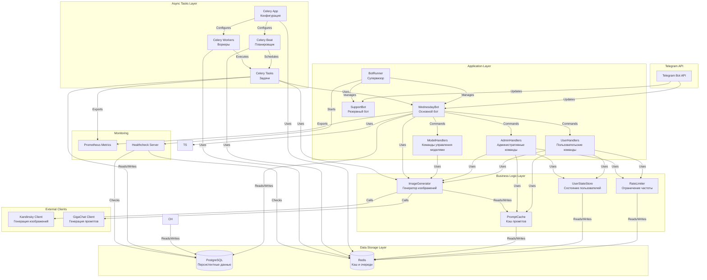
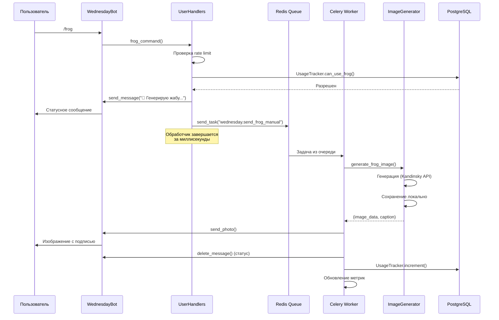
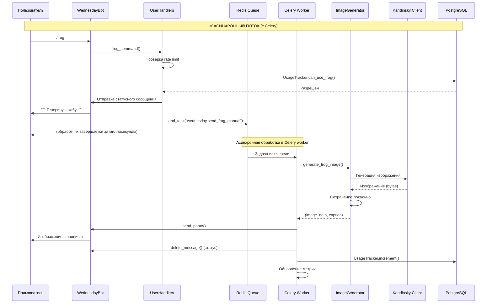
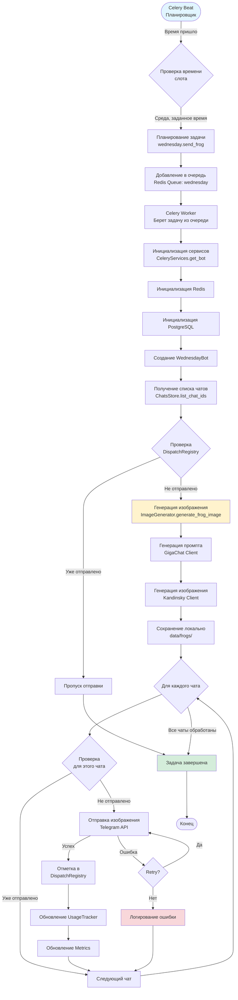
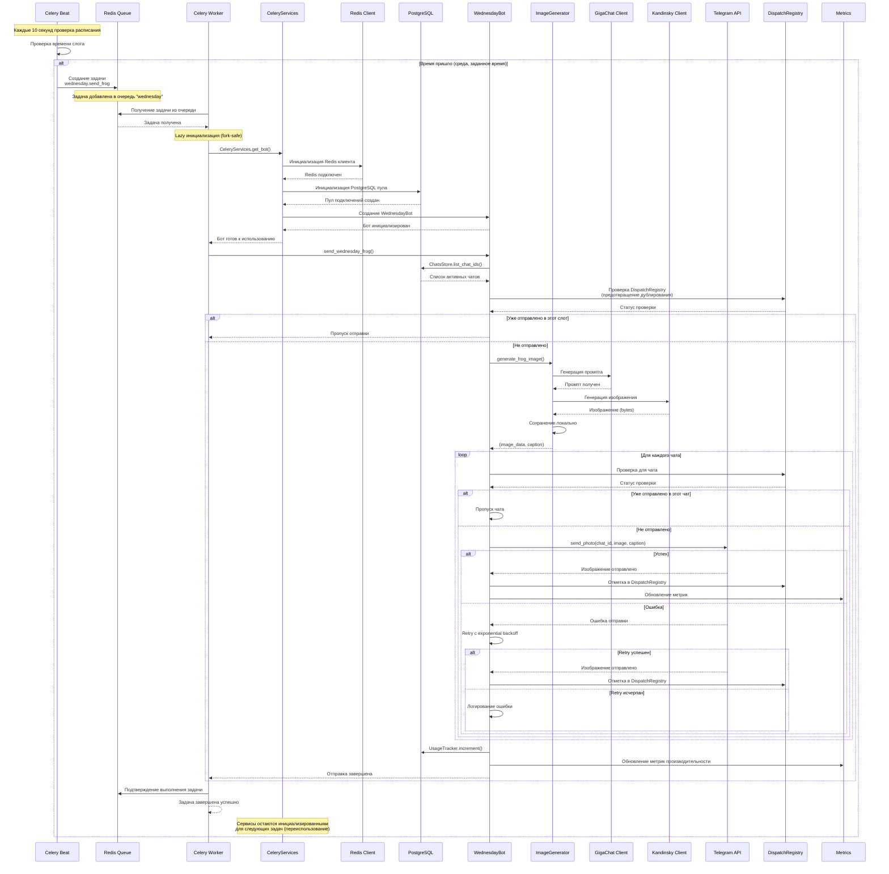

# Архитектура Wednesday Frog Bot

## Обзор

Wednesday Frog Bot — это Telegram-бот для автоматической генерации и отправки изображений жабы каждую среду. Проект использует многоуровневую архитектуру с разделением ответственности между компонентами.

### Основные слои архитектуры

1. **Интерфейсный слой** — взаимодействие с Telegram API через python-telegram-bot
2. **Бизнес-логика** — обработка команд, генерация изображений, планирование задач
3. **Хранилище данных** — PostgreSQL для персистентных данных, Redis для кэша и очередей
4. **Асинхронные задачи** — Celery для фоновых операций и планирования

## Компоненты системы

### BotRunner

**Назначение:** Супервизор, управляющий жизненным циклом ботов и переключением между основным и резервным режимами.

**Основные функции:**
- Инициализация и управление WednesdayBot и SupportBot
- Graceful shutdown при получении сигналов (SIGINT, SIGTERM)
- Переключение между основным и резервным ботом без потери соединений
- Инициализация инфраструктуры (Redis, PostgreSQL)
- Запуск вспомогательных сервисов (Prometheus exporter, healthcheck server)

**Особенности:**
- Использует паттерн Supervisor для управления двумя ботами
- Обеспечивает, что только один бот активен в любой момент времени
- Передает состояние между ботами через `pending_startup_edit` и `pending_shutdown_edit`

### WednesdayBot

**Назначение:** Основной бот с полным функционалом генерации и отправки изображений.

**Основные функции:**
- Обработка команд пользователей и администраторов
- Генерация изображений через `ImageService`
- Автоматическая отправка по расписанию (через Celery)
- Управление чатами и пользователями
- Отслеживание использования и метрик

**Компоненты:**
- `UserHandlers`, `AdminHandlers`, `ModelHandlers` — обработка команд (пользовательских, административных и модельных)
- `BotServices` — контейнер зависимостей для передачи во все хендлеры
- `ImageService` — координация генерации изображений
- `UsageTracker` — отслеживание лимитов
- `ChatsStore` — управление активными чатами
- `DispatchRegistry` — предотвращение дублирования отправок
- `Metrics` — сбор метрик производительности

### SupportBot

**Назначение:** Резервный бот, активируемый при остановке основного бота.

**Основные функции:**
- Отображение сообщения о техработах для пользователей
- Предоставление доступа к логам администраторам
- Команда `/start` для запуска основного бота
- Команда `/log` для получения лог-файлов
- Команда `/help` для справки
- Минимальный набор команд для обслуживания

**Особенности:**
- Никогда не работает одновременно с WednesdayBot
- Использует тот же Telegram токен, но с ограниченным функционалом
- Автоматически активируется при остановке основного бота
- **Наследуется от `BaseHandlers`** для переиспользования общих методов (`_send_log_file`, `_retry_on_connect_error`, `_safe_reply_text`)
- **Использует `AppSettings`** для доступа к настройкам через DI, вместо прямого чтения из глобального `config`
- **Использует минимальный `BotServices`** (только с `settings` и `rate_limiter`) для работы с `BaseHandlers`
- **Унифицированный retry helper** для всех отправок сообщений через `BaseHandlers._retry_on_connect_error`
- **Классификация исключений** по типам (Infrastructure/Programming/Business ошибки) для улучшенной отладки
- **Не использует `bot_data` для DI** — все зависимости доступны через экземпляр `SupportBot` и `BotServices`

### Handler Architecture

**Назначение:** Обработка всех команд Telegram-бота с разделением ответственности по специализированным классам.

**Структура иерархии:**

- **`BaseHandlers`** (`bot/base_handlers.py`): Базовый класс с общими утилитарными методами
  - `_is_super_admin`: Проверка прав главного администратора
  - `_safe_reply_text`: Безопасная отправка текста с retry
  - `_retry_on_connect_error`: Обёртка для retry-логики
  - `_extract_target_user_id`: Извлечение ID пользователя из reply или аргументов
  - `_send_log_file`: Отправка лог-файла как документа
  - Содержит `services: BotServices` и `admins_store: AdminsStore` для доступа к зависимостям

- **`UserHandlers`** (`bot/handlers_user.py`): Наследуется от `BaseHandlers`, обрабатывает пользовательские команды
  - `/start`: Приветствие и регистрация пользователя
  - `/help`: Справка по командам
  - `/frog`: Генерация и отправка изображения жабы (с rate limiting через Redis)
  - `/unknown`: Обработка неизвестных команд

- **`AdminHandlers`** (`bot/handlers_admin.py`): Наследуется от `BaseHandlers`, обрабатывает административные команды
  - `/status`: Статус бота и метрики
  - `/force_send`: Принудительная отправка изображения
  - `/add_chat`, `/remove_chat`, `/list_chats`: Управление чатами
  - `/log`: Получение лог-файла
  - `/stop`: Остановка бота
  - `/mod`, `/unmod`, `/list_mods`: Управление администраторами
  - `/set_frog_limit`, `/set_frog_used`: Управление лимитами

- **`ModelHandlers`** (`bot/handlers_models.py`): Наследуется от `BaseHandlers`, обрабатывает команды управления моделями
  - `/set_kandinsky_model`: Установка модели Kandinsky
  - `/set_gigachat_model`: Установка модели GigaChat
  - `/list_models`: Список доступных моделей

- **`SupportBot`** (`bot/support_bot.py`): Наследуется от `BaseHandlers`, резервный бот с ограниченным функционалом
  - `/start`: Запуск основного бота (если доступен callback)
  - `/log`: Получение лог-файла (только для администраторов)
  - `/help`: Справка по командам
  - Обработка неизвестных команд с сообщением о техработах
  - Использует минимальный `BotServices` (только с `settings` и `rate_limiter`)

**Особенности архитектуры:**

- Все хендлеры получают зависимости через `BotServices` в конструкторе, исключая скрытые зависимости
- Разделение ответственности по зонам: пользовательские, административные и модельные команды в отдельных классах
- Переиспользование общих методов через наследование от `BaseHandlers`
- **Класс `CommandHandlers` удален** — вся логика распределена по специализированным хендлерам
- Rate limiting для команды `/frog` реализован через `RateLimiter` (Redis) для поддержки горизонтального масштабирования
- Проверка прав администратора для админ-команд через `AdminsStore`
- Retry логика для сетевых ошибок через `BaseHandlers._retry_on_connect_error` (использует `utils/telegram_retry`)
- Дружелюбные сообщения об ошибках для пользователей

### Services

**Dependency Injection (DI):**

Проект использует **явную ручную инициализацию зависимостей** через контейнер `BotServices` без специализированных DI-библиотек:

- **Контейнер зависимостей `BotServices`:** Все основные сервисы собираются в единый dataclass `BotServices`, который передается во все обработчики и компоненты. Финальный контракт контейнера включает:
  - `image_service`: Application‑сервис координации генерации изображений
  - `usage`: Трекер использования (`UsageTracker`)
  - `chats`: Хранилище чатов (`ChatsStore`)
  - `dispatch_registry`: Реестр отправок
  - `metrics`: Обёртка над метриками
  - `prompt_cache`: Кэш промптов
  - `user_state_store`: Хранилище состояния пользователей
  - `settings`: Настройки приложения (`AppSettings`)
  - `frog_rate_limiter`: Application‑сервис rate limiting для команды `/frog`
  - `frog_request_service`: Application‑сервис постановки задач в Celery
  - `bot_controller`: Ссылка на экземпляр бота для команд управления
  - `postgres_pool`: Пул подключений PostgreSQL (опционально, для прямого доступа)
  - `redis_client`: Redis-клиент (опционально, для прямого доступа)
- **Настройки через `AppSettings`:** Инкапсулирует основные настройки приложения (например, `admin_chat_id`, `chat_id`, `scheduler_send_times`, параметры rate limiting), доступные через `BotServices.settings`. Инициализируется один раз при создании бота из глобального `Config` в composition root (`infra/container.py`).
- **Явная передача инфраструктурных зависимостей:** Все функции сборки (`build_bot`, `build_bot_services`, `build_image_stack`, `build_admin_dashboard_service`) принимают `db_pool` и `redis_client` явно через параметры, а не через глобальные функции `get_postgres_pool()` и `get_redis()`. Это обеспечивает прозрачность зависимостей и упрощает тестирование.
- **Валидация параметров:** Все функции `build_*` проверяют, что обязательные параметры не равны `None`, и выбрасывают `ValueError` с понятным сообщением при нарушении.
- **В BotRunner:** Инфраструктурные зависимости (Postgres, Redis) инициализируются и валидируются в методе `_init_and_validate_infrastructure()`, затем передаются в `build_bot()`. Сервисы создаются в composition root (`build_bot_services()`), собираются в `BotServices` и передаются в обработчики.
- **В обработчиках:** Все зависимости доступны через `self.services` (экземпляр `BotServices`), передаваемый в конструкторе. Для прямого доступа к инфраструктурным зависимостям используются поля `postgres_pool` и `redis_client` в `BotServices`.
- **Для внешних клиентов:** Клиенты создаются через `ClientManagementService` и регистрируются в контейнерах (`ImageClientContainer`, `TextClientContainer`) для поддержки runtime-замены без рестарта бота

**Протокольный слой сервисов:**

- `ICircuitBreaker` — абстракция для circuit breaker с методами `is_open()`, `record_success()`, `record_failure()`
- `ICache[T]` — generic-протокол кэша с операциями `get()`, `set()`, `delete()`
- `IImageStorage` — протокол файлового хранилища изображений (байтовый интерфейс `save()`/`get_random()`)
- `IPromptStorage` — протокол файлового хранилища промптов (`save()`/`load_all()`)

**Важно:** `bot_data` больше не используется для передачи зависимостей. Все зависимости доступны через `BotServices`, что обеспечивает явность зависимостей, упрощает тестирование (легко подставлять моки через конструкторы) и исключает скрытые зависимости через глобальное состояние.

#### ImageService

**Назначение:** Координация генерации изображений жабы с помощью Kandinsky API и GigaChat.

**Основные функции:**
- Генерация промптов через `PromptService` (GigaChat + fallback)
- Генерация изображений через `ImageGenerationService` и `ITextToImageClient`
- Circuit breaker для защиты от перегрузки API через `ICircuitBreaker`
- Кэширование изображений через `ICache[tuple[bytes, str]]`
- Сохранение изображений локально через `IImageStorage`
- Fallback на случайные изображения из архива при ошибках

**Архитектура:**
- Использует Protocol-интерфейсы (`ICache`, `IImageStorage`, `IPromptStorage`, `ICircuitBreaker`, `IMetrics`, `ITextToImageClient`, `ITextToTextClient`)
- Dependency Injection для клиентов через `ClientManagementService` в composition root (`infra.container._create_clients()`)
- Поддержка runtime-замены клиентов через контейнеры (`ImageClientContainer`, `TextClientContainer`) с кастомными конфигами
- Все настройки (лимиты ретраев, подписи и т.п.) передаются через composition root (`infra.container.py`)

#### RateLimiter

**Назначение:** Ограничение частоты запросов на основе Redis.

**Алгоритм:**
- Fixed window rate limiting
- Атомарные операции через Redis INCR/EXPIRE
- Автоматический fallback в in-memory режим при недоступности Redis
- **Fail-open политика:** Не блокирует пользователей при сбоях инфраструктуры (если Redis недоступен, лимитирование не применяется)

**Использование:**
- Все rate limits в системе реализуются через `RateLimiter` (Redis-based)
- Команда `/frog` использует per-user и global лимиты через Redis, что обеспечивает горизонтальное масштабирование при работе нескольких инстансов бота
- Per-user лимит: один запрос за заданный период времени (по умолчанию 5 минут)
- Global лимит: максимальное количество запросов за окно времени (по умолчанию 10 запросов в минуту)

#### Retry Policy

**Назначение:** Унифицированная обработка повторных попыток при сетевых ошибках и rate limits Telegram API.

**Для PTB-хендлеров (python-telegram-bot):**

- **Унифицированный helper `utils/telegram_retry.retry_on_connect_error`:**
  - Обрабатывает сетевые ошибки (`httpx.ConnectError`, `httpx.ConnectTimeout`, `httpx.ReadTimeout`, `NetworkError`, `TimedOut`)
  - Поддерживает обработку rate limit (TelegramError с кодом 429)
  - При обнаружении 429 и `handle_rate_limit=True`: читает `retry_after` из атрибута ошибки или заголовков ответа и использует его как задержку перед следующей попыткой
  - Для других сетевых ошибок использует экспоненциальный backoff (базовая задержка умножается на номер попытки)
  - Используется в обработчиках команд через `BaseHandlers._retry_on_connect_error`
  - Используется в `WednesdayBot.send_wednesday_frog` для автоматической отправки изображений
  - Используется в `SupportBot` для всех отправок сообщений (обеспечивает консистентность с `WednesdayBot`)
- **Декоратор `retry_on_telegram_error`:** Удобная обёртка для методов, делающих вызовы Telegram API

**Для Celery-тасок:**

- Используется встроенная retry-политика Celery через параметры задач (`@celery_app.task(...)`)
- Настройка через параметры `max_retries`, `default_retry_delay`, `autoretry_for`
- Обработка сетевых ошибок и rate limits Telegram API в контексте асинхронных задач

**Классификация исключений:**

- **Infrastructure ошибки** (retry + мягкая деградация): `TelegramError`, `NetworkError`, `TimedOut` для сетевых/Telegram ошибок
- **Programming/Business ошибки** (логировать и поднимать): `ValueError`, `TypeError`, `AttributeError` для логических ошибок
- **Обвязочный код** (shutdown, декораторы): `except Exception:` оставлен только в критических местах (например, `stop_command` для фоллбека остановки) с добавлением `exc_info=True` в логирование

**Применение в SupportBot:**
- Все исключения в `SupportBot` классифицированы по типам для улучшенной отладки и обработки ошибок
- Infrastructure ошибки обрабатываются с retry через `BaseHandlers._retry_on_connect_error`
- Programming/Business ошибки логируются и поднимаются для быстрого обнаружения проблем
- Обвязочный код (shutdown, инициализация) использует `except Exception:` с `exc_info=True` для полного логирования критических ошибок

### Стратегия обработки ошибок в слое `app/`

**Основные принципы:**

- **Ожидаемые доменные/инфраструктурные ошибки**:
  - Используются специализированные исключения из `shared.base.exceptions`: `ServiceError`, `RepoError`, `MessagingAPIError`, `MessagingNetworkError`, `StorageError`, `CacheError`, `ClientError` и производные.
  - В application‑сервисах перехватываются *конкретные* типы ошибок с понятной реакцией: логирование с `event/status`, обновление метрик, мягкая деградация (fallback‑логика) без падения cron/бота.
- **Неожиданные программные ошибки**:
  - Для truly unexpected кейсов введена иерархия `Unexpected*Error` (`UnexpectedDispatchError`, `UnexpectedImageError`, `UnexpectedPromptError`, `UnexpectedAPIError`), наследующаяся от `UnexpectedAppError`.
  - Такие ошибки создаются при перехвате «сырых» `Exception` в координаторах `DispatchExecutionService`, `FallbackService`, `ImageService`, `PromptService`, `APIStatusService` и логируются как `unexpected_*` с полным traceback.
  - После логирования `Unexpected*Error` **пробрасываются выше** (через `raise ... from e`), чтобы верхний уровень (`DispatchService` / bot‑слой) мог принять решение: запустить fallback‑сценарий, отправить алерт, зафейлить задачу и т.п.
- **Границы ответственности**:
  - `DispatchService` отвечает за перевод любых ошибок (как ожидаемых `ServiceError`, так и `Unexpected*Error`) в единый fallback‑сценарий через `FallbackService`, сохраняя устойчивость cron‑рассылок.
  - Внутренние координаторы (`ImageService`, `PromptService`, `APIStatusService`) не скрывают программные баги: они либо возвращают контролируемый результат/`None` для ожидаемых сбоев, либо поднимают `Unexpected*Error` для явных аномалий.

#### PromptCache

**Назначение:** Кэширование промптов и параметров генерации в Redis.

**Особенности:**
- Ускоряет повторные генерации с теми же параметрами
- Снижает нагрузку на GigaChat API
- Автоматическая очистка устаревших записей

#### UserStateStore

**Назначение:** Временное хранение состояния пользователей (диалоги, флаги).

**Использование:**
- Состояния диалогов для многошаговых команд
- Временные флаги и метаданные
- Автоматическое истечение через TTL

### Workers (Celery)

#### Celery App

**Назначение:** Конфигурация Celery для асинхронных задач.

**Настройки:**
- Redis как брокер и backend
- Разделение задач по очередям: `wednesday`, `images`, `maintenance`
- Настройка retry для сетевых ошибок
- Dead Letter Queue для неудачных задач
- Timezone support для корректного планирования

#### Celery Beat

**Назначение:** Планировщик периодических задач.

**Задачи:**
- `wednesday.send_frog` — отправка изображений каждую среду в заданное время
- `wednesday.daily_cleanup` — ежедневная очистка старых данных
- `wednesday.daily_statistics` — сбор статистики
- `wednesday.beat_heartbeat` — healthcheck для Beat

**Расписание:**
- Настраивается через `SCHEDULER_SEND_TIMES` (по умолчанию: 09:00, 12:00, 18:00)
- День недели настраивается через `SCHEDULER_WEDNESDAY_DAY` (по умолчанию: 2 = среда)

#### Celery Tasks

**Основные задачи:**

1. **`send_wednesday_frog`** — автоматическая отправка изображений
   - Lazy инициализация сервисов (fork-safe)
   - Retry для сетевых ошибок
   - Soft/hard time limits

2. **`generate_frog_image`** — генерация изображения в фоне
   - Используется для асинхронной генерации по команде `/frog`
   - Отдельная очередь для изоляции

3. **`daily_cleanup`** — очистка старых данных
   - Очистка dispatch_registry
   - Удаление временных файлов

4. **`daily_statistics`** — сбор статистики
   - Агрегация метрик
   - Обновление дашбордов

**Особенности:**
- **Lazy инициализация через `CeleryServices` (fork-safe):** Критически важно для корректной работы Celery в Python. Сервисы (Redis, PostgreSQL, WednesdayBot) инициализируются **только после fork** worker процесса, внутри задач. Это предотвращает:
  - Утечки ресурсов (разделяемые соединения между процессами)
  - Ошибки "connection already closed" при fork
  - Race conditions при одновременном доступе к соединениям
  - Проблемы с async клиентами (aiohttp, asyncpg), которые не являются fork-safe
- Graceful shutdown при остановке worker
- Метрики Prometheus для мониторинга

## Схемы взаимодействия

### Диаграмма 1: Общая схема компонентов (Component Diagram)

### Диаграмма 2: Поток данных при генерации изображения по команде `/frog` (Sequence Diagram)

**Примечание:** Эта диаграмма показывает упрощённый поток. Для детального асинхронного потока с Celery см. Диаграмму 2a.

### Диаграмма 2a: Асинхронный поток команды `/frog` (с Celery)

### Диаграмма 3: Поток данных автоматической отправки (Flowchart)

### Диаграмма 3a: Детальный поток автоматической отправки через Celery (Sequence Diagram)

Эта диаграмма показывает детальное взаимодействие компонентов при автоматической отправке через Celery, включая:
- Lazy инициализацию сервисов (fork-safe подход)
- Взаимодействие с Redis и PostgreSQL
- Обработку ошибок и retry логику
- Обновление метрик и реестра отправок

## Потоки данных

### 1. Ручная генерация (`/frog`)

1. Пользователь отправляет команду `/frog`
2. `UserHandlers.frog_command()` проверяет rate limit (глобальный и per-user) через `RateLimiter` (Redis)
3. Проверяется лимит генераций через `UsageTracker.can_use_frog()`
4. Отправляется статусное сообщение пользователю
5. Задача `wednesday.send_frog_manual` ставится в очередь Celery через `celery_app.send_task()`
6. Обработчик завершается (за миллисекунды, Event Loop не блокируется)
7. Celery worker берёт задачу из очереди и выполняет:
   - `ImageGenerator.generate_frog_image()` генерирует изображение:
     - Получает или генерирует промпт (GigaChat или fallback)
     - Генерирует изображение через Kandinsky API
     - Сохраняет локально
   - Изображение отправляется пользователю через `bot.application.bot.send_photo()`
   - Удаляется статусное сообщение
   - Обновляются счетчики использования (`UsageTracker.increment()`) и метрики

**Примечание:** Команда `/frog` теперь использует Celery для асинхронной обработки. Обработчик выполняет только валидацию (rate limits, месячный лимит) и постановку задачи в очередь, что обеспечивает быстрый ответ пользователю (завершается за миллисекунды) и исключает блокировку Event Loop. Генерация и отправка изображения выполняются асинхронно в Celery worker, что улучшает масштабируемость системы. Автоматические отправки по расписанию также используют Celery.

### 2. Автоматическая отправка (Celery Beat)

1. Celery Beat проверяет расписание каждые 10 секунд
2. При наступлении времени слота (среда, заданное время) создается задача
3. Задача добавляется в очередь Redis (`wednesday`)
4. Celery Worker берет задачу из очереди
5. Инициализируются сервисы (lazy init, fork-safe)
6. `WednesdayBot.send_wednesday_frog()` выполняется:
   - Получается список активных чатов
   - Проверяется `DispatchRegistry` для предотвращения дублирования
   - Генерируется одно изображение для всех чатов
   - Для каждого чата:
     - Проверка, не было ли уже отправлено в этот слот
     - Отправка изображения с retry логикой
     - Отметка в `DispatchRegistry`
     - Обновление метрик

### 3. Обработка ошибок

**При генерации изображения:**
- Circuit breaker защищает от перегрузки API
- Fallback на случайные изображения из архива
- Дружелюбные сообщения пользователям
- Детальные логи для администраторов

**При отправке:**
- Retry с exponential backoff
- Обработка rate limits Telegram API (429)
- Логирование всех ошибок
- Метрики неудачных отправок

## Конфигурация

Проект следует принципам **12 Factor App** для управления конфигурацией:

**Источники конфигурации (в порядке приоритета):**
1. **Переменные окружения** (`os.environ`) — основной источник для production
2. **Файл `.env`** — fallback для локальной разработки (загружается через `python-dotenv`)
3. **Secret-файлы** — поддержка чтения из файлов через переменные вида `*_FILE` (например, `POSTGRES_PASSWORD_FILE`)

**Класс `Config`:**
- Централизованное управление всеми настройками
- Валидация обязательных переменных при старте
- Ленивая загрузка `.env` файла (только если переменная отсутствует в окружении)
- Типизированные свойства для доступа к настройкам

**Основные переменные окружения:**
- `TELEGRAM_BOT_TOKEN` — токен Telegram бота
- `KANDINSKY_API_KEY`, `KANDINSKY_SECRET_KEY` — ключи Kandinsky API
- `GIGACHAT_AUTHORIZATION_KEY` — ключ GigaChat API (опционально)
- `POSTGRES_*` — параметры подключения к PostgreSQL
- `REDIS_*` — параметры подключения к Redis
- `SCHEDULER_SEND_TIMES` — времена отправки (формат: `09:00,12:00,18:00`)
- `SCHEDULER_WEDNESDAY_DAY` — день недели для отправки (по умолчанию: 2 = среда)

**Примечание:** Все секреты и чувствительные данные должны храниться в переменных окружения или secret-файлах, никогда не коммититься в репозиторий.

## Хранилища данных

### PostgreSQL

**Таблицы:**
- `chats` — активные чаты для рассылки
- `admins` — дополнительные администраторы
- `prompts` — сохраненные промпты
- `models_kandinsky`, `models_gigachat` — текущие модели и доступные варианты
- `usage_stats` — статистика использования
- `usage_settings` — настройки квот для `/frog`
- `dispatch_registry` — реестр отправок (anti-duplicate)
- `metrics` — агрегированные метрики производительности
- `metrics_events` — детальные события генерации
- `images` — метаданные content-addressable хранилища изображений

**Использование:**
- Персистентное хранение настроек
- Отслеживание использования API
- Предотвращение дублирования отправок
- Управление моделями и промптами

**Схема и миграции:**

Проект использует **идемпотентный подход** к управлению схемой БД:

- **Модуль `postgres_schema.py`** содержит DDL-скрипты для создания всех таблиц
- **Функция `ensure_schema()`** вызывается при каждом старте приложения
- Все CREATE-операции используют `CREATE TABLE IF NOT EXISTS`, что делает их безопасными для повторного выполнения
- **Миграции выполняются автоматически** при первом запуске или при добавлении новых таблиц

**Примечание:** Это не полноценная система миграций (типа Alembic или Flyway), а простой подход с DDL-скриптами. Для production рекомендуется рассмотреть использование инструментов миграций для версионирования изменений схемы.

### Redis

**Использование:**
- **Кэш:** `PromptCache`, параметры генерации
- **Очереди:** Celery broker и backend
- **Rate Limiting:** счетчики запросов
- **Circuit Breaker:** состояние и счетчики ошибок
- **User State:** временное состояние пользователей

**Особенности:**
- Автоматический fallback в in-memory режим
- Fail-open политика (не блокирует пользователей)
- TTL для автоматической очистки

## Мониторинг и метрики

### Prometheus Metrics

- `frog_generations_total` — общее количество генераций
- `frog_generation_latency_seconds` — время генерации
- `celery_tasks_total` — количество Celery задач
- `celery_task_duration_seconds` — длительность задач
- `celery_task_failures_total` — количество ошибок

### Healthcheck

- HTTP endpoint `/health` для проверки состояния
- Проверка доступности PostgreSQL и Redis
- Проверка доступности очереди метрик `metrics:events` (Redis Stream)
- Проверка доступности Celery workers/Heartbeat для Celery Beat

### Логирование

- Структурированное логирование через Loguru
- Ротация логов по дням
- Архивация старых логов
- Интеграция с Sentry для отслеживания ошибок

## Безопасность

### Защита от злоупотреблений

1. **Rate Limiting:**
   - Per-user: 5 минут между запросами `/frog`
   - Global: 10 запросов в минуту

2. **Usage Tracking:**
   - Лимит ручных генераций (по умолчанию 70 в месяц)
   - Автоматические отправки не ограничены

3. **Circuit Breaker:**
   - Защита от перегрузки API
   - Cooldown при множественных ошибках

4. **Админ-команды:**
   - Проверка прав через `AdminsStore`
   - Главный админ из `ADMIN_CHAT_ID` не может быть удален

### Обработка ошибок

- Graceful degradation при недоступности Redis
- Retry с exponential backoff для сетевых ошибок
- Timeout handling для всех внешних вызовов
- Детальное логирование всех ошибок
- Circuit breaker для защиты API

## Масштабирование

### Горизонтальное масштабирование

- **Celery Workers:** можно запускать несколько воркеров для параллельной обработки задач
- **Redis:** поддерживает кластеризацию для высокой доступности
- **PostgreSQL:** репликация для чтения, connection pooling

### Вертикальное масштабирование

- Настройка пулов подключений (PostgreSQL, Redis)
- Оптимизация таймаутов и retry логики
- Кэширование для снижения нагрузки на API

## Зависимости

### Внешние сервисы

- **Telegram Bot API** — основной интерфейс
- **Kandinsky API** — генерация изображений
- **GigaChat API** — генерация промптов

### Инфраструктура

- **PostgreSQL** — персистентное хранилище
- **Redis** — кэш и очереди
- **Celery** — асинхронные задачи

## Заключение

Архитектура Wednesday Frog Bot спроектирована с учетом:
- **Надежности** — graceful shutdown, retry логика, circuit breaker
- **Масштабируемости** — разделение на слои, асинхронные задачи
- **Отказоустойчивости** — fallback режимы, обработка ошибок
- **Мониторинга** — метрики, логирование, healthcheck
- **Безопасности** — rate limiting, проверка прав, защита от злоупотреблений
